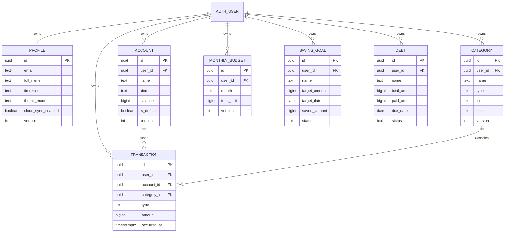
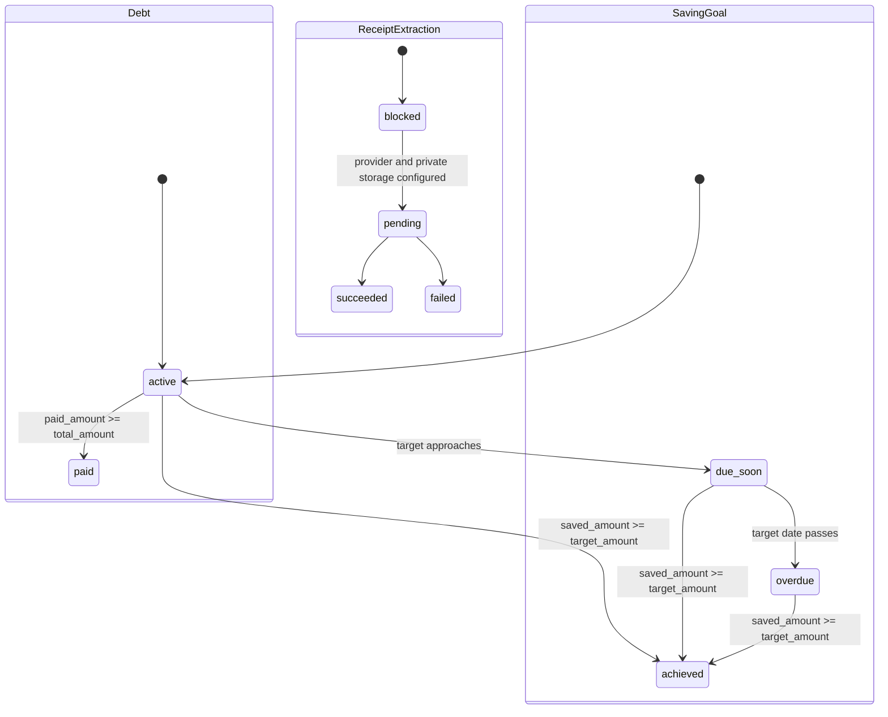

# Backend Contract — Catat Duekku

**Contract version:** 1.0.0  
**Public base path:** `/api/v1`  
**Audience:** Expo client, Supabase Edge Function implementation, database/RLS implementers

## 1. Authority and scope

This contract is based on the active Expo UI and its current local/in-memory behavior. The authoritative target architecture is:

```text
Expo client
├── Supabase Auth (direct SDK; signup/login/logout/reset/session)
└── /api/v1 (Supabase Edge Function modular REST router)
    └── Supabase Postgres with RLS
```

`docs/API-REST.md` describes Express 4, Prisma, Vercel, and Neon. That conflicts with `docs/ARCHITECTURE.md`, which states Supabase Auth + Supabase Postgres/RLS + Supabase Edge Functions and no separate Vercel backend. **This contract resolves the conflict in favor of the Supabase architecture.** Express/Prisma is historical, non-authoritative planning material.

The active UI is not REST-backed yet: finance data is in memory/static, profile sync is simulated, receipt extraction is mocked, and natural-language parsing is local with an optional client-side provider call. This document defines only the REST migration surface needed by that UI.

### Included operations (19)

| # | Method | Path | Active UI need |
|---:|---|---|---|
| 1 | GET | `/me/profile` | Profile/edit profile |
| 2 | PATCH | `/me/profile` | Edit full name/preferences |
| 3 | POST | `/sync` | “Sinkronkan ulang” action |
| 4 | DELETE | `/me/data` | Reset financial data |
| 5 | GET | `/accounts` | Manage and receipt account picker |
| 6 | POST | `/accounts` | Add account |
| 7 | GET | `/categories` | Manage and receipt category picker |
| 8 | POST | `/categories` | Add category |
| 9 | GET | `/budgets/current` | Current-month budget card |
| 10 | PUT | `/budgets/current` | Create/update current limit |
| 11 | GET | `/saving-goals` | Savings deck |
| 12 | POST | `/saving-goals` | Create target |
| 13 | GET | `/debts` | Debt card |
| 14 | POST | `/debts` | Create debt/installment |
| 15 | POST | `/transactions` | Confirm manual/parser/receipt transaction |
| 16 | GET | `/summary` | Dashboard totals |
| 17 | GET | `/analytics/overview` | Active seven-month analytics UI |
| 18 | POST | `/parser` | Active AI input preview; no persistence |
| 19 | POST | `/receipts/extractions` | Active scan preview; **BLOCKED** |

No list pagination, search, sort, or domain filters are defined because the active UI has none. The sole filter is analytics `period`.

### Explicitly outside REST

- Supabase Auth signup, login, logout, password reset, session refresh, and email changes.
- Device PIN and biometric enablement, prompts, lock state, and hardware capability. They remain device-local/auth-flow concerns; the REST API must never accept plaintext PIN, PIN hash, or biometric material.
- Transaction list/detail/edit/delete, account/category/debt/goal edit/delete, debt payments, goal movements, budget envelopes, imports/exports, Telegram, and last-action correction/undo. They exist in broader planning/local parser behavior but are not required by the currently exposed persistence UI requested for this contract.

## 2. Common HTTP contract

### Authentication and role

Every operation requires `Authorization: Bearer <Supabase access JWT>`. The Edge Function verifies signature, issuer, audience, expiry, and obtains the user identity exclusively from JWT `sub`.

There is exactly one application role: **`AUTHENTICATED_USER`**. No admin or service role is exposed by this API. A Supabase service-role credential, if used inside an Edge Function, is implementation infrastructure and never an API actor; ownership checks and RLS remain mandatory.

### Headers

| Header | Applies | Rule |
|---|---|---|
| `Authorization` | all | Required bearer Supabase JWT |
| `Content-Type: application/json` | JSON writes | Required |
| `Idempotency-Key` | all POST operations | Recommended; 8–128 printable characters |
| `If-Match` | PATCH profile, PUT budget | Optional quoted integer resource version |
| `X-Request-Id` | all | Optional client correlation ID; server generates one if absent |

### Success envelopes

Single resource:

```json
{
  "data": { "id": "4d9fce7d-4f58-4d15-b34a-570d145ba3b7" },
  "meta": { "request_id": "01J2XK6YSPB3MZ0K2C2RCB7H4F" }
}
```

List resource (never paginated in this version):

```json
{
  "data": [],
  "meta": { "request_id": "01J2XK6YSPB3MZ0K2C2RCB7H4F" }
}
```

No `page`, `cursor`, or invented total is returned.

### Error envelope

```json
{
  "error": {
    "code": "VALIDATION_FAILED",
    "message": "Request validation failed.",
    "details": [{ "field": "amount", "reason": "must be greater than 0" }]
  },
  "meta": { "request_id": "01J2XK6YSPB3MZ0K2C2RCB7H4F" }
}
```

Error codes and status mappings are authoritative in [ERROR-CATALOG.md](./ERROR-CATALOG.md).

### Naming, money, time, and IDs

- JSON uses `snake_case`.
- IDs are UUID strings generated server-side.
- Money is integer IDR (`int64`), never floating point. Write amounts are positive; transaction response `amount` is signed (`EXPENSE` negative, `INCOME` positive).
- Instants are RFC 3339 UTC strings. Calendar dates are `YYYY-MM-DD`; months are `YYYY-MM`.
- Names are trimmed, 1–100 Unicode characters. Notes/descriptions are at most 500 characters.
- Unknown request properties are rejected.

### Ownership and RLS

Every domain row is owned by the JWT subject:

```sql
user_id = auth.uid()
```

`profiles.id = auth.uid()`. All selects, inserts, updates, and deletes require matching ownership through RLS (`USING` and `WITH CHECK`). The client never sends `user_id`; supplied ownership fields are rejected. References such as `account_id` and `category_id` must resolve to active rows owned by the same JWT subject. A foreign-owned or absent referenced resource is returned as `404 RESOURCE_NOT_FOUND`, preventing ownership enumeration.

### Idempotency and concurrency

- For POST, the server stores `(user_id, route, Idempotency-Key, canonical request hash, response)` for at least 24 hours.
- Replaying the same key and body returns the original status/body. Reusing the key with a different body returns `409 IDEMPOTENCY_KEY_REUSED`.
- Without a key, retries may create duplicates; the client should not automatically retry writes.
- Resource responses include integer `version`, beginning at `1`. `PATCH /me/profile` and `PUT /budgets/current` accept `If-Match: "<version>"`; mismatch returns `412 VERSION_CONFLICT`.
- Transaction creation and account balance update occur in one database transaction with row locking. Creation of unique current budgets/categories/accounts is constraint-backed; races return the existing idempotent response when keyed or `409 RESOURCE_CONFLICT` otherwise.
- GET operations are safe and may be retried.

## 3. Domain model



### Status lifecycles



Goal `due_soon` means target date is within 30 calendar days and the goal is not achieved. Status is computed, not client writable. Debt status is computed from amounts. Receipt extraction is currently always `blocked`; `pending/succeeded/failed` document the activation contract, not a currently available asynchronous service.

## 4. Permission matrix

| Resource/action | AUTHENTICATED_USER | Ownership rule |
|---|---:|---|
| Read/update profile | Allow | `profile.id = JWT sub` |
| Trigger sync | Allow | only caller’s rows |
| Reset data | Allow | only caller’s finance rows |
| List/create accounts | Allow | own rows; server sets `user_id` |
| List/create categories | Allow | own rows; server sets `user_id` |
| Get/upsert current budget | Allow | own `(user_id, current month)` |
| List/create saving goals | Allow | own rows |
| List/create debts | Allow | own rows |
| Create transaction | Allow | own account/category references |
| Read summary/analytics | Allow | aggregates only caller’s rows |
| Parse text | Allow | caller context only; no write |
| Extract receipt | Blocked | no upload accepted until configured |

Unauthenticated access is denied (`401`). There is no cross-user access and no admin override in the public contract.

## 5. Endpoint contracts

Each endpoint specifies purpose, request, validation, processing, response, and errors.

### GET `/me/profile`

**Purpose:** Populate profile/edit-profile.  
**Request:** No body/query.  
**Processing:** Read email from verified Supabase identity and profile preferences from the caller-owned profile; lazily create defaults if absent. PIN/biometric fields are excluded.  
**200:** `Profile` envelope.

```json
{"data":{"id":"8b95fe72-a5cb-4bd2-a7bd-23c80da704c0","email":"ayu@example.com","full_name":"Ayu Lestari","timezone":"Asia/Jakarta","theme_mode":"system","cloud_sync_enabled":true,"version":1,"created_at":"2026-07-01T08:00:00Z","updated_at":"2026-07-22T09:00:00Z"},"meta":{"request_id":"01J2XK6YSPB3MZ0K2C2RCB7H4F"}}
```

**Errors:** `401 AUTHENTICATION_REQUIRED`, `503 SERVICE_UNAVAILABLE`.

### PATCH `/me/profile`

**Purpose:** Update REST-owned profile preferences. Active edit UI currently sends `full_name`; email remains Supabase Auth-owned.  
**Headers:** Optional `If-Match`.  
**Body:** At least one of `full_name`, `timezone`, `theme_mode`, `cloud_sync_enabled`.

```json
{"full_name":"Ayu Lestari"}
```

**Validation:** `full_name` 1–100 after trim; `timezone` valid IANA name, max 64; `theme_mode` is `system|light|dark`; email/user/security metadata rejected.  
**Processing:** Partial update; increment `version`. Implementer must decide whether `full_name` is mirrored back to Supabase Auth metadata; profile table is the REST response source.  
**200:** Updated `Profile` envelope.  
**Errors:** `400 INVALID_JSON`, `401`, `412 VERSION_CONFLICT`, `422 VALIDATION_FAILED`.

### POST `/sync`

**Purpose:** Replace the active fake “resync” delay with a server health/reconciliation barrier.  
**Body:** none.  
**Processing:** Ensure caller profile/default records exist and return server revision. It does not upload arbitrary client snapshots and does not create jobs.  
**200:**

```json
{"data":{"status":"synchronized","server_time":"2026-07-22T09:15:00Z","revision":"2026-07-22T09:15:00.123456Z"},"meta":{"request_id":"01J2XK6YSPB3MZ0K2C2RCB7H4F"}}
```

**Errors:** `401`, `429 RATE_LIMITED`, `503`.

### DELETE `/me/data`

**Purpose:** Destructively reset caller-owned financial data while retaining Supabase Auth identity/profile. Device PIN/biometric cleanup remains client-local.  
**Body:**

```json
{"confirmation":"RESET"}
```

**Validation:** Exact case-sensitive confirmation.  
**Processing:** In one transaction delete/soft-delete caller transactions, debts, goals, budgets, categories, and accounts, then recreate required default accounts/categories if the implementation uses defaults. Never affects other users or auth identity.  
**200:**

```json
{"data":{"status":"reset","reset_at":"2026-07-22T09:20:00Z"},"meta":{"request_id":"01J2XK6YSPB3MZ0K2C2RCB7H4F"}}
```

**Errors:** `401`, `422 RESET_CONFIRMATION_REQUIRED`, `409 RESOURCE_CONFLICT`, `503`.

### GET `/accounts`

**Purpose:** Populate manage account rows and receipt payment source picker.  
**Request:** No query/body. No pagination/filter.  
**Processing:** Return all active caller-owned accounts in stable `created_at,id` order.  
**200:** List of `Account`.

```json
{"data":[{"id":"0c177a15-b185-4714-95a1-b1bb43414db3","name":"Cash","kind":"CASH","balance":1150000,"is_default":true,"account_number":null,"icon":null,"version":1,"created_at":"2026-07-01T08:00:00Z","updated_at":"2026-07-01T08:00:00Z"}],"meta":{"request_id":"01J2XK6YSPB3MZ0K2C2RCB7H4F"}}
```

**Errors:** `401`, `503`.

### POST `/accounts`

**Purpose:** Add the account shown by Manage UI.  
**Body:**

```json
{"name":"Bank BCA","kind":"BANK","opening_balance":0,"is_default":false}
```

**Validation:** name 1–100; kind `CASH|BANK|E_WALLET`; opening balance integer >= 0; optional account number max 64, icon max 64. Active UI only captures name, so omitted kind defaults to `BANK` and opening balance defaults to `0`.  
**Processing:** Create owned account. A case-insensitive active name duplicate returns conflict. Setting default atomically clears prior default.  
**201:** `Account` envelope; `Location: /api/v1/accounts/{id}`.  
**Errors:** `401`, `409 ACCOUNT_NAME_EXISTS`, `422`, `503`.

### GET `/categories`

**Purpose:** Populate category manage chips and transaction/receipt choices.  
**Request:** No query/body. No pagination/filter.  
**Processing:** Return all active caller-owned categories in stable `type,name,id` order.  
**200:** List of `Category`.  
**Errors:** `401`, `503`.

### POST `/categories`

**Purpose:** Add a transaction category.  
**Body:**

```json
{"name":"Kesehatan","type":"EXPENSE","icon":"health","color":"#22C55E"}
```

**Validation:** name 1–100; type `INCOME|EXPENSE` (defaults to `EXPENSE`, matching active form); icon max 64; color `#RRGGBB`.  
**Processing:** Unique active `(user_id, lower(name), type)`.  
**201:** `Category` envelope.  
**Errors:** `401`, `409 CATEGORY_NAME_EXISTS`, `422`, `503`.

### GET `/budgets/current`

**Purpose:** Current calendar-month budget card.  
**Request:** No query; month derives from profile timezone and server time.  
**Processing:** Aggregate current-month expense transactions. If no budget exists, return `data: null` (not 404), with current month in meta.  
**200 example:**

```json
{"data":{"id":"bdf55c48-f15f-439b-a54b-975bf4dc52ec","month":"2026-07","total_limit":5000000,"used_amount":3450000,"remaining_amount":1550000,"percent_used":69,"day_of_month":22,"days_in_month":31,"days_left":9,"version":2,"created_at":"2026-07-01T00:00:00Z","updated_at":"2026-07-22T08:00:00Z"},"meta":{"request_id":"01J2XK6YSPB3MZ0K2C2RCB7H4F"}}
```

**Errors:** `401`, `503`.

### PUT `/budgets/current`

**Purpose:** Create or replace current-month total limit.  
**Headers:** Optional `If-Match`; use `If-Match: "0"` to require create-only.  
**Body:** `{"total_limit":5000000}`.  
**Validation:** integer 1..9,000,000,000,000,000.  
**Processing:** Atomic upsert on `(user_id, month)`; month server-derived. Computed usage is never writable.  
**200:** `MonthlyBudget` envelope (also for creation, preserving idempotent upsert semantics).  
**Errors:** `401`, `412`, `422`, `503`.

### GET `/saving-goals`

**Purpose:** Populate active savings deck.  
**Request:** No query/body/pagination/filter.  
**Processing:** Return caller-owned non-deleted goals, stable `created_at,id` order, with computed fields/status.  
**200:** List of `SavingGoal`.  
**Errors:** `401`, `503`.

### POST `/saving-goals`

**Purpose:** Create a target from Manage UI.  
**Body:**

```json
{"name":"Beli Laptop Baru","target_amount":15000000,"target_date":"2026-12-31"}
```

**Validation:** name 1–100; target amount positive integer; target date optional valid date not before current profile-local date. `saved_amount` is server initialized to 0.  
**201:** `SavingGoal` envelope.  
**Errors:** `401`, `422`, `503`.

### GET `/debts`

**Purpose:** Populate debt card.  
**Request:** No query/body/pagination/filter.  
**Processing:** Return non-deleted debts, active first then paid, stable by due date and id, with computed status/progress.  
**200:** List of `Debt`.  
**Errors:** `401`, `503`.

### POST `/debts`

**Purpose:** Create debt/installment from active Manage form.  
**Body:**

```json
{"name":"Cicilan Motor","total_amount":12000000,"tenor_months":12,"paid_installments":2,"start_date":"2026-07-01"}
```

**Validation:** name 1–100; total positive integer; tenor 1..600; paid installments 0..tenor; valid start date.  
**Processing:** `monthly_amount = ceil(total_amount / tenor_months)`; `paid_amount = min(total_amount, monthly_amount * paid_installments)`; projected payoff and next due date are calendar-month calculations; status derives from amounts. All computed fields are read-only.  
**201:** `Debt` envelope.  
**Errors:** `401`, `422 INVALID_INSTALLMENT_PLAN`, `503`.

### POST `/transactions`

**Purpose:** Persist the user-confirmed manual, parser, or receipt transaction. Parsing/extraction never auto-saves.  
**Body:**

```json
{"type":"EXPENSE","amount":45000,"account_id":"0c177a15-b185-4714-95a1-b1bb43414db3","category_id":"a9ab345a-c586-44c3-8706-a0958407a761","category_name":"Makan & Harian","description":"Warung Nasi Bu Edi","note":"Makan siang","occurred_at":"2026-07-22T05:30:00Z","source":"RECEIPT"}
```

**Validation:** type only `INCOME|EXPENSE`; amount positive integer; owned active account required; category ID optional but if supplied must be owned and match transaction type; category name optional snapshot, max 100; description/note max 500; occurred time defaults to now and cannot be more than 24 hours in the future; source `MANUAL|PARSER|RECEIPT`.  
**Processing:** Convert amount to signed storage value and atomically update account balance. Persist category name snapshot. `RECEIPT` is accepted only from a user-confirmed preview; no extraction ID is required while extraction is blocked.  
**201:** `Transaction` envelope.  
**Errors:** `401`, `404 ACCOUNT_NOT_FOUND|CATEGORY_NOT_FOUND`, `409 RESOURCE_CONFLICT`, `422`, `503`.

### GET `/summary`

**Purpose:** Dashboard totals.  
**Request:** No query/body/filter. Current month uses profile timezone.  
**Processing:** Aggregate caller accounts, current-month income/expense, prior-month comparison, remaining active debt, and recent transactions needed by dashboard. Recent transactions are fixed at five; this is response composition, not public pagination.  
**200:** `Summary` envelope.  
**Errors:** `401`, `503`.

### GET `/analytics/overview?period=7m`

**Purpose:** Populate all active analytics tabs/cards with one aggregate response.  
**Query:** `period` is optional enum `7m`, default `7m`; no other filter is accepted.  
**Processing:** Seven profile-local calendar month buckets ending in current month; current-month KPIs; top six expense categories; busiest weekday, largest category, quietest week, and current-month expense transaction count. Empty data returns zeros and empty arrays. Insight is deterministic aggregate text; no AI call is required.  
**200:** `AnalyticsOverview` envelope.  
**Errors:** `401`, `422 UNSUPPORTED_ANALYTICS_PERIOD`, `503`.

### POST `/parser`

**Purpose:** Support the active natural-language AI input preview. This endpoint is included because the UI actively parses as the user types. It has no financial side effect.  
**Body:** `{"input":"makan siang 25 ribu pakai bank"}`.  
**Validation:** trimmed input 1–500 characters.  
**Processing:** Deterministic Indonesian parser first; configured server-side AI fallback only when needed; validate output. Resolve account/category suggestions only against caller-owned records. Never save or mutate. Supported intents match the active parser: `create_expense`, `create_income`, `set_balance`, `create_debt`, `pay_debt`, `create_goal`, `deposit_goal`, `withdraw_goal`, `update_last_amount`, `update_last_account`, `undo_last`, `get_summary`, `unknown`. Some intents do not have REST execution endpoints in this limited active-UI contract; clients must treat the response as a preview and may only persist supported `INCOME|EXPENSE` drafts through `/transactions`.  
**200:** `ParserResult` envelope.

```json
{"data":{"intent":"create_expense","confidence":0.92,"needs_confirmation":true,"fields":{"amount":25000,"account_id":"0c177a15-b185-4714-95a1-b1bb43414db3","account_name":"Bank","category_name":"Makan & Harian","description":"makan siang"},"reason":null},"meta":{"request_id":"01J2XK6YSPB3MZ0K2C2RCB7H4F"}}
```

**Errors:** `401`, `422`, `429 PARSER_RATE_LIMITED`, `502 PARSER_PROVIDER_FAILED` only when no valid local result can be returned, `503`.

### POST `/receipts/extractions` — BLOCKED

**Purpose:** Future replacement for the active mocked receipt scan preview. No transaction is saved.  
**Current behavior:** Always return `503 RECEIPT_EXTRACTION_BLOCKED`. The server must not accept, buffer, or log image bytes while blocked.

```json
{"error":{"code":"RECEIPT_EXTRACTION_BLOCKED","message":"Receipt extraction is unavailable until a provider and private storage are configured.","details":[]},"meta":{"request_id":"01J2XK6YSPB3MZ0K2C2RCB7H4F"}}
```

**Activation prerequisites:** configure a receipt/OCR provider, private Supabase Storage bucket, signed upload authorization, MIME/magic-byte validation, image resizing, retention/deletion policy, malware/content controls, per-user quotas, secret management, and log redaction.

**Activated request contract (reserved, not currently accepted):** `multipart/form-data` with one `image` part; JPEG/PNG/HEIC; verified maximum 10 MiB; no public URL.  
**Activated async contract:** respond `202` with an extraction resource in `pending`; process from private storage; transition to `succeeded` or `failed`; delete source image no later than 24 hours after terminal state. A status polling endpoint is intentionally not added because provider/storage and UI polling are not configured; activation requires a contract revision adding retrieval or a synchronous bounded response.  
**Successful draft fields when activated:** merchant, total, date, suggested category/account IDs and names, description, confidence, `needs_confirmation: true`. It must never create a transaction automatically.

## 6. Aggregate response semantics

### Summary

- `total_balance`: sum of active account balances.
- `total_income_month`: sum of positive `INCOME` in current month.
- `total_expense_month`: sum of absolute `EXPENSE` in current month.
- `percentage_change`: expense change versus prior month; `null` when prior month is zero.
- `remaining_debt`: sum of `total_amount - paid_amount` for active debts.

### Analytics

- Month buckets always contain exactly seven entries for `7m`, including zero months.
- `net_savings = income - expense`.
- Category percentages divide by current-month expense and are rounded to nearest integer; empty denominator yields no slices.
- “Busiest weekday” is the weekday with greatest expense; “quietest week” uses calendar day groups 1–7, 8–14, 15–21, 22–28, 29–end among weeks containing transactions.
- Ties use earliest calendar occurrence, then lexical label, ensuring deterministic output.

## 7. Implementation boundaries

- Modular router modules should map to profile, sync, accounts, categories, budgets, saving goals, debts, transactions, aggregates, parser, and receipts inside one Supabase Edge Function public router.
- Validate at the Edge Function boundary and rely on Postgres constraints/RLS again at persistence.
- Never ship Supabase service-role, AI provider, or storage signing secrets to Expo.
- Avoid sensitive request/image/parser content in logs; log request ID, operation ID, status, latency, and stable error code only.
- OpenAPI source of truth for machine consumers is [`../api/openapi.yaml`](../api/openapi.yaml); it must remain behaviorally identical to this contract.
